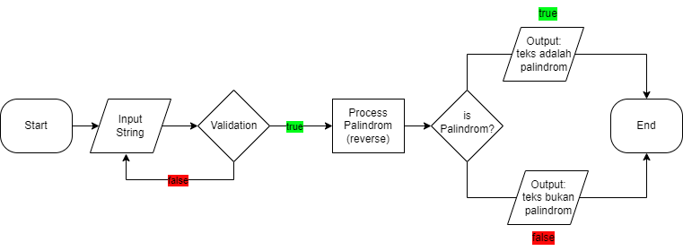
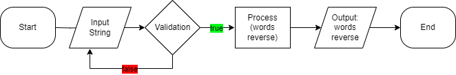

<h1>1. Deteksi Palindrom</h1>

<ol>
 <li>Mulai</li>
 <li>Input kata 'malam'</li>
 <li>Validasi kata = string</li>
 <li>Reverse kata tampung pada variabel baru</li>
 <li>Validasi variabel baru = palindrom</li>
 <li>Hasil output 'ini adalah palindrom'</li>
 <li>Berakhir</li>
</ol>

 
 

<h1>2. Reverse Word</h1>

<ol>
 <li>Mulai</li>
 <li>Input kalimat 'Saya belajar Javascript'</li>
 <li>Validasi kalimat = string</li>
 <li>Reverse kalimat tampung pada variabel baru</li>
 <li>Hasil output panggil variabel baru 'Javascript belajar Saya'</li>
 <li>Berakhir</li>
</ol>
